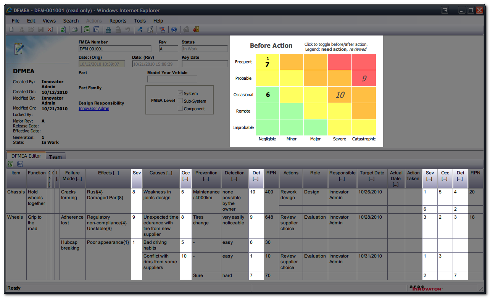

>## Archived Aras Community Project
*This project has been migrated to GitHub from the old Aras Projects page (http://www.aras.com/projects). As an Archived project, this project is no longer being actively developed or maintained.*

>*For current projects, please visit the new Aras Community Projects page on the updated Aras Community site: http://community.aras.com/projects*

# DFMEA Visual Matrix

This add-on adds a colored matrix to the DFMEA form, allowing visual representation of the severity/occurrence/detectability of a DFMEA:

* X axis represents severity
* Y axis represents occurrence
* The cells contain the detectability, further reflected by the font size
* Clicking on the table toggles between before and after action

## History

This project and the following release notes have been migrated from the old Aras Projects page. Unlike community projects that have been migrated and archived, this project will be updated for compatibility with the latest release of Aras Innovator.

Release | Notes
--------|--------
[v1](https://github.com/ArasLabs/dfmea-visual-matrix/releases/tag/v1) | This version is compatible with 9.2.0, 9.2.0 SP1, and 9.2.0 SP2.

#### Supported Aras Versions

Project | Aras
--------|------
[v1](https://github.com/ArasLabs/dfmea-visual-matrix/releases/tag/v1) | 9.2.0, 9.2.0 SP1, 9.2.0 SP2

## Installation

#### Important!
**Always back up your code tree and database before applying an import package or code tree patch!**

### Pre-requisites

1. Aras Innovator installed
2. Aras Package Import tool
3. **com.aras.innovator.solution.QP** import packages

### Install Steps

1. Backup your database and store the BAK file in a safe place.
2. Open up the Aras Package Import tool.
3. Enter your login credentials and click **Login**
  * _Note: You must login as root for the package import to succeed!_
4. Enter the package name in the TargetRelease field.
  * Optional: Enter a description in the Description field.
5. Enter the path to your local `..\dfmea-visual-matrix\Import\imports.mf` file in the Manifest File field.
6. Select **com.aras.innovator.solution.QP** in the Available for Import field.
7. Select Type = **Merge** and Mode = **Thorough Mode**.
8. Click **Import** in the top left corner.
9. Close the Aras Package Import tool.

## Usage

See [README_dfmeaMatrix.txt](./Documentation/README_dfmeaMatrix.txt) for more information on using this project.

## Contributing

1. Fork it!
2. Create your feature branch: `git checkout -b my-new-feature`
3. Commit your changes: `git commit -am 'Add some feature'`
4. Push to the branch: `git push origin my-new-feature`
5. Submit a pull request

For more information on contributing to this project, another Aras Labs project, or any Aras Community project, shoot us an email at araslabs@aras.com.

## Credits

Created by Aras Corporation Support.

Original idea by Ronan Jouchet.

## License

Aras Labs projects are published to Github under the MIT license. See the [LICENSE file](./LICENSE.md) for license rights and limitations.
